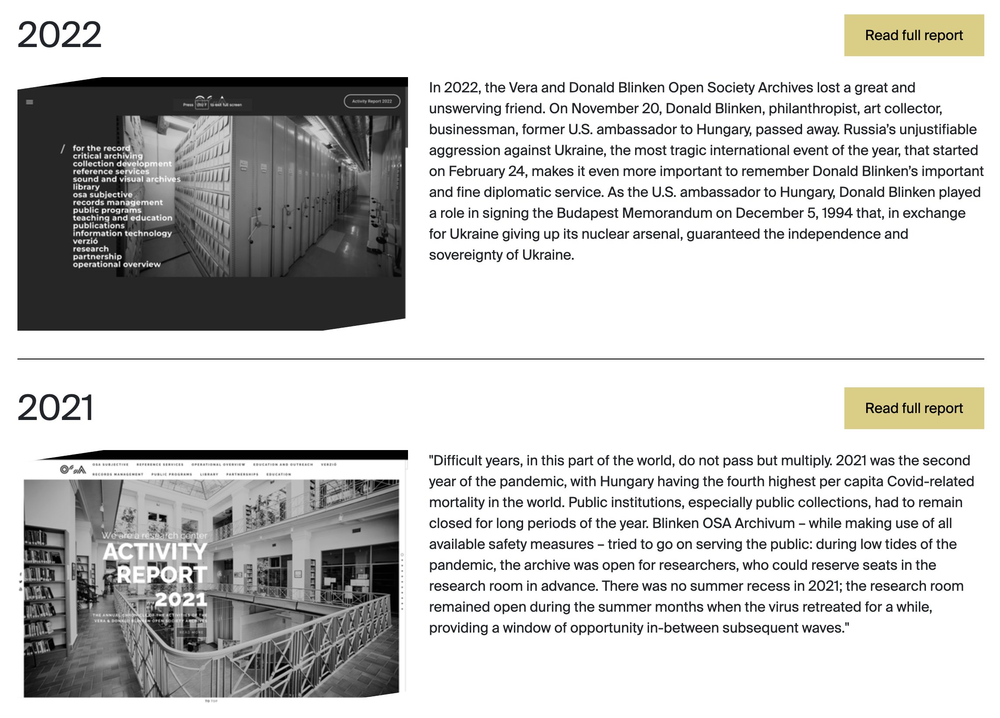

# Annual Report

Use **Annual Report** for downloadable or externally hosted annual reports.

## Where records appear

| Website location | Presentation |
| --- | --- |
| About Us → Annual Reports | Full-width report card with year, cover, description, and button; ordered by Year descending |

## Frontend example

*On the Annual Reports page, `Year` appears as the large heading, `Image` supplies the cover, and `Description` appears beside it. The “Read full report” button opens the URL in `Link`.*

## Field-to-frontend map

| Strapi field | [Scope](index.md#field-scope) | Where on the frontend | Display and editorial effect |
| --- | --- | --- | --- |
| `Description` | Localized, required | Report card body | Text displayed beside the cover. |
| `Link` | Shared, required | Report button | Opens in a new browser tab. |
| `Image` | Shared, required | Report card | Cover image. |
| `Year` | Localized | Card heading and ordering | Large year label and descending sort value; use four digits consistently. |
