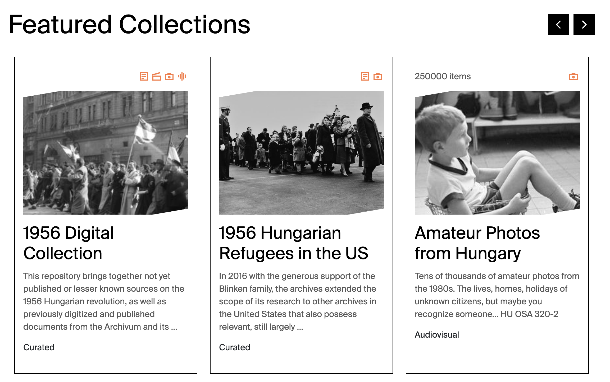

# Collection

Use **Collection** for selected archival collections shown on the homepage and collection listing pages.

## Where Collection records appear

| Website location | Presentation |
| --- | --- |
| Homepage Collections carousel | Card; first nine records ordered by `rank`, then Title |
| Curated Collections, Online Collections, and AV Collections listings | Filtered card with item count, material icons, image, title, summary, and collection type |
| `/collections/{type-route}/{slug}` | Detail page with title, Content body, optional visit button, and Related Materials |
| Related Materials elsewhere | Collection card |

### Homepage Featured Collections example

*Published Collection records become cards in the homepage Featured Collections carousel. `Image`, `Title`, and `CardText` provide the primary card content; `MaterialTypes` supplies the orange icons; `Size` supplies the item count; and `ContentTypes` supplies the card classification. The `rank` field controls which records appear first.*

#### Material type icons

Every value selected in `MaterialTypes` adds an orange icon to the upper-right area of the Collection card.

| Strapi `MaterialTypes` value | Card icon | Tooltip |
| --- | :---: | --- |
| `Textual` | { .collection-material-icon } | Textual |
| `Moving Image` | { .collection-material-icon } | Moving image |
| `Audio` | { .collection-material-icon } | Audio |
| `Still Image` | { .collection-material-icon } | Still image |

Collections can have several material types. The card displays one icon for each selected value, in the order stored by Strapi. On desktop, pointing at an icon displays its localized tooltip.

## Field-to-frontend map

| Strapi field | [Scope](index.md#field-scope) | Where on the frontend | Display and editorial effect |
| --- | --- | --- | --- |
| `Title` | Localized, required | Homepage/list card; detail heading; metadata; related card | Public collection name. Cards truncate long titles. |
| `Image` | Shared, required | Cards and social preview | Primary card artwork. Some detail layouts use a simple heading instead of the image. |
| `CardText` | Localized, required | Cards and social description | Short summary; truncated on cards. |
| `ContentOld` | Localized, required | Not displayed | Legacy field. It is required by Strapi but not fetched/rendered. |
| `Link` | Localized | Detail page | Optional external “visit” button on Curated, Online, and AV detail pages. |
| `Tags` | Shared | No visible page element | Stored for classification/search. |
| `ContentTypes` | Shared, required | Listing membership, card label, detail URL | First selected value controls routing. `Curated`, `Online`/`Digital`, and `AV` are supported. `Library` has no current card route. |
| [`MaterialTypes`](#material-type-icons) | Shared, required | Listing/homepage card | Produces one orange icon and localized tooltip for every selected material type. |
| `rank` | Localized | Homepage carousel | Lower values appear first; Title breaks ties. |
| `Size` | Localized | Listing/homepage card | Shows “item/items” when greater than zero. |
| `Slug` | Localized, required | Detail URL | Final path segment. |
| `Content` | Localized | Detail body | Actual visible body, despite being optional in Strapi. |
| `RelatedEntries`, `RelatedEvents`, `RelatedNews`, `RelatedPages`, `RelatedProjects` | Relations | Related Materials | Adds corresponding cards below the body. |
| `RelatedCollectionsSource`, `RelatedCollectionsDestination` | Self-relations | Related Materials | Adds other Collection cards. |

!!! warning
    Build the real detail body in `Content`, not `ContentOld`. Do not make `Library` the first ContentTypes value without developer review.
