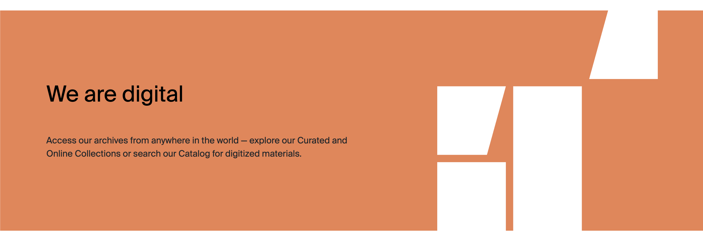

# Credo

Each published **Credo** record becomes a slide in the homepage “We are…” section.

## Where records appear

| Website location | Presentation |
| --- | --- |
| Homepage Credo panel | Animated text-and-logo carousel, ordered by rank and then creation date |

## Frontend example

*A Collections-type Credo slide. `WeAre` supplies the heading, `CredoText` supplies the supporting copy, and `Type` determines the colour and decorative graphic.*

!!! info "`Type` is the Credo profile"
    Credo uses the field name `Type`, but it performs the same visual role as `Profile` on other content types. Its values map to the same four section identities and control the slide colour and decorative category graphic. See [Profiles and visual identity](../profiles.md#credo-uses-type) for the value mapping.

## Field-to-frontend map

| Strapi field | [Scope](index.md#field-scope) | Where on the frontend | Display and editorial effect |
| --- | --- | --- | --- |
| `WeAre` | Localized, required | Large slide heading | The “We are…” statement/title. |
| `CredoText` | Localized | Supporting text | Animated below the heading. |
| [`Type`](../profiles.md#credo-uses-type) | Localized, required | Slide logo and colour | Credo's equivalent of `Profile`: Archivum, Collection, Academics, or Public Programs selects the corresponding category graphic and palette. |
| `rank` | Localized | Carousel ordering | Lower values appear first; newer creation date breaks ties. |
