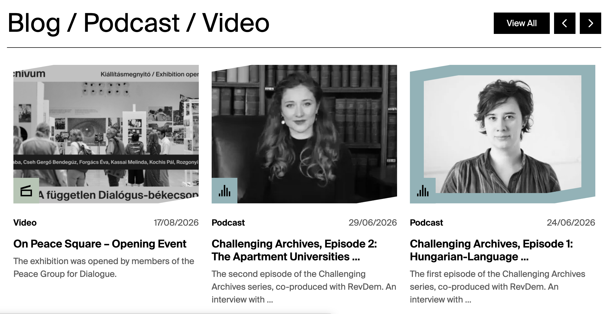
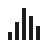

# Entry

Use **Entry** for Blog, Podcast, and Video editorial posts.

## Where Entry records appear

| Website location | Presentation |
| --- | --- |
| Homepage Entries carousel | Card; newest OriginalCreationDate first, then creation date |
| Entries listing | Paginated/filterable card grid |
| `/entries/{entry-type}/{slug-or-id}` | Detail page with image header, publication date, author area, component body, and Related Materials |
| Staff profile Blogs tab | Compact linked Entry row when related through AuthorStaff |
| Related Materials elsewhere | Entry card |

### Homepage Blog / Podcast / Video carousel example

*Published Entry records become cards in the homepage carousel. `Image`, `Title`, and `CardText` provide the main content; `OriginalCreationDate` supplies the displayed date; `EntryType` supplies the label and icon; and `Profile` supplies the coloured square and image underlayer.*

### Entry type icons

`EntryType` determines the label and black icon displayed on each Entry card. [`Profile`](../profiles.md) supplies the coloured square behind the icon and the card's associated section styling.

| Strapi `EntryType` value | Card icon | Card label | Detail URL segment |
| --- | :---: | --- | --- |
| `Blog` | { .activity-type-icon } | Blog | `/entries/blog/{slug-or-id}` |
| `Podcast` | { .activity-type-icon } | Podcast | `/entries/podcast/{slug-or-id}` |
| `Video` | { .activity-type-icon } | Video | `/entries/video/{slug-or-id}` |

The homepage Entries carousel, Entries listing, and Related Materials cards reuse these type icons. Changing `EntryType` also changes the public detail URL, so check existing links and add a URL Redirect when changing the type of published content.

## Field-to-frontend map

| Strapi field | [Scope](index.md#field-scope) | Where on the frontend | Display and editorial effect |
| --- | --- | --- | --- |
| `Title` | Localized, required | Card, detail header, metadata, staff tab, related card | Public post title. |
| `Image` | Shared, required | Cards, detail header, metadata, staff tab | Frontend treats this as an image even though the schema permits other media. |
| `CardText` | Localized, required | Cards, metadata, staff tab, related card | Teaser summary; truncated on cards. |
| `Language` | Localized | Not displayed | Stored but unused by current Entry views. |
| [`EntryType`](#entry-type-icons) | Shared, required | Card label/icon and URL | Selects the Blog, Podcast, or Video label and icon and creates the `/entries/{type}/...` route. |
| [`Profile`](../profiles.md) | Shared, required | Card/detail colour and listing filter | Selects Archivum, Collections, Academic, or Public styling/filtering. |
| `PodcastLink` | Localized | Not displayed | Current frontend does not read it. Put the usable link/media in Content. |
| `Tags` | Shared | No visible page element | Stored for classification/search. |
| `Content` | Localized, required | Detail body | Ordered dynamic-zone body. |
| `Slug` | Localized | Detail URL | Preferred path; numeric ID is fallback. |
| `Author` | Localized | Detail author area | Plain-text author. |
| `AuthorStaff` | Relation | Detail author badges; Staff Blogs tab | Links staff authors and creates reverse staff-profile entries. |
| `OriginalCreationDate` | Localized | Card/detail date and ordering | Preferred publication date; Strapi creation date is fallback. |
| `rank` | Localized | Not displayed/used | Current Entry queries do not sort by rank. |
| `RelatedCollections`, `RelatedEvents`, `RelatedNews`, `RelatedPages`, `RelatedProjects` | Relations | Related Materials | Adds corresponding cards. |
| `RelatedEntriesSource`, `RelatedEntriesDestination` | Self-relations | Related Materials | Adds other Entry cards. |
