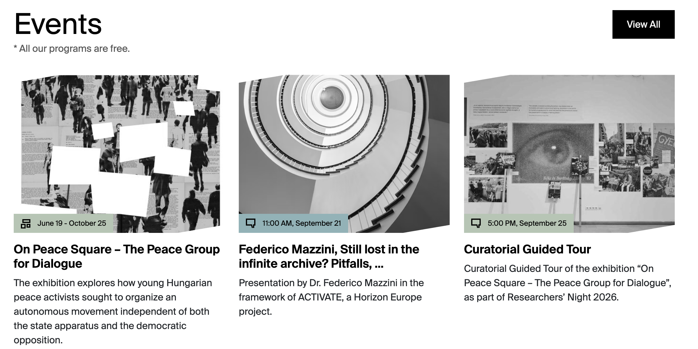
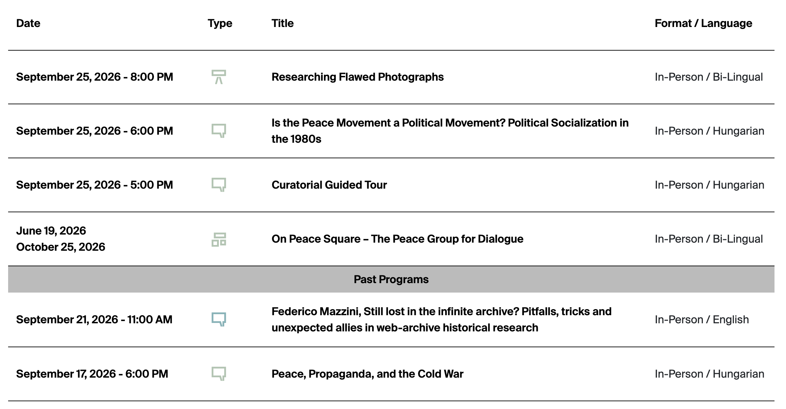

# Event

Use **Event** for public programs and other dated activities.

## Where Event records appear

| Website location | Presentation |
| --- | --- |
| Homepage Events panel | Up to four upcoming cards ordered by StartDate |
| Program Calendar | Current/past row with date, icon/type, title, hosting format, and language; expandable teaser and buttons |
| `/events/{slug-or-id}` | Detail page with image header, type, dates, venue, format/language, buttons, component body, and Related Materials |
| Related Materials elsewhere | Event card |

### Homepage Events example

*Upcoming Event records become homepage cards. `Image`, `Title`, and `CardText` provide the main card content. `EventType` supplies the icon, `Profile` supplies the label colour, and `StartDate` supplies the displayed time and date. Exhibitions with an `EndDate` display a date range.*

### Program Calendar example

*The Program Calendar presents `StartDate` and applicable `EndDate`, the `EventType` icon, `Title`, and the combined `HostingType` and `Language`. The icon colour follows `Profile`. Selecting a row expands its image, teaser, detail link, and registration button when available.*

### Event type icons

The homepage card places the black `EventType` icon inside the profile-coloured date label. The Program Calendar displays the same icon in the profile colour and reveals the localized event-type label as a tooltip on desktop.

| Strapi `EventType` value | Icon | Icon used |
| --- | :---: | --- |
| `Academic News` | { .activity-type-icon } | Academics category |
| `Announcement` | { .activity-type-icon } | Announcement |
| `Archivum News` | { .activity-type-icon } | Archivum category |
| `Book Launch` | { .activity-type-icon } | Book launch |
| `Collections News` | { .activity-type-icon } | Collections category |
| `Community` | { .activity-type-icon } | Community |
| `Conference` | { .activity-type-icon } | Conference |
| `Education Program` | { .activity-type-icon } | Education program |
| `Exhibition` | { .activity-type-icon } | Exhibition |
| `Film Screening` | { .activity-type-icon } | Film screening |
| `Guided Tour` | { .activity-type-icon } | Talk/speech |
| `Internship` | { .activity-type-icon } | Internship |
| `Job` | { .activity-type-icon } | Job |
| `Join Us` | { .activity-type-icon } | Join us |
| `Lecture` | { .activity-type-icon } | Talk/speech |
| `Library` | { .activity-type-icon } | Library |
| `Music` | { .activity-type-icon } | Music |
| `Partner Projects` | { .activity-type-icon } | Partner projects |
| `Performance` | { .activity-type-icon } | Theatre |
| `Program Series` | { .activity-type-icon } | Program series |
| `Public Program News` | — | **No icon is currently mapped by the frontend.** |
| `Publication` | { .activity-type-icon } | Publication |
| `Research` | { .activity-type-icon } | Research |
| `Roundtable` | { .activity-type-icon } | Roundtable |
| `Scholarship` | { .activity-type-icon } | Scholarship |
| `Talk` | { .activity-type-icon } | Talk/speech |
| `Theatre` | { .activity-type-icon } | Theatre |
| `University Course` | { .activity-type-icon } | University course |
| `Workshop` | { .activity-type-icon } | Workshop |

!!! warning
    Avoid `Public Program News` when an Event icon is required. Although Strapi offers the value, the current frontend does not map it to an icon, and its multi-word tooltip lookup is inconsistent with the available translation key.

## Field-to-frontend map

| Strapi field | [Scope](index.md#field-scope) | Where on the frontend | Display and editorial effect |
| --- | --- | --- | --- |
| `Title` | Localized, required | Homepage card, calendar, detail header, metadata, related card | Public event title. |
| `Subtitle` | Localized | Not displayed | Stored but unused by current event views. |
| `StartDate` | Localized, required | Card, calendar, detail, ordering/current status | Main date/time. Enter the correct time zone. |
| `EndDate` | Localized | Card/calendar for exhibitions; detail; past detection | Produces an end date/range and helps classify past events. |
| `Location` | Localized | Detail page | Venue label/value. |
| `Language` | Shared | Calendar filter/format column; detail metadata | Translated Hungarian, English, or Bi-Lingual label. |
| [`EventType`](#event-type-icons) | Shared, required | Card/calendar icon and detail type tag | Selects event classification, mapped icon, and translated label. `Public Program News` currently has no mapped icon. |
| `HostingType` | Shared, required | Calendar filter/format column; detail metadata | Online, Hybrid, or In-Person label. |
| [`Profile`](../profiles.md) | Shared, required | Colour and Program Calendar program filter | Selects Archivum, Collections, Academic, or Public presentation. |
| `CardText` | Localized, required | Homepage card, social description, calendar fallback, related card | Main teaser. |
| `RegistrationLink` | Shared | Calendar expansion and detail page | Registration button destination. |
| `Tags` | Shared | No visible page element | Stored for classification/search. |
| `Content` | Localized, required | Detail body | Ordered dynamic-zone body. |
| `Slug` | Localized | Detail URL | Preferred path; numeric ID is fallback. |
| `ZoomLink` | Shared | Detail page | Join-on-Zoom button. |
| `Image` | Shared | Card, calendar expansion, detail header, metadata | Treat as editorially required although the schema does not. |
| `rank` | Localized | Not used for ordering | Current Event lists sort by StartDate. |
| `DescriptionShort` | Localized | Expanded Program Calendar row | Preferred calendar teaser; CardText is fallback. |
| `RelatedCollections`, `RelatedEntries`, `RelatedNews`, `RelatedPages`, `RelatedProjects` | Relations | Related Materials | Adds corresponding cards. |
| `RelatedEventsSource`, `RelatedEventsDestination` | Self-relations | Related Materials | Adds other Event cards. |
