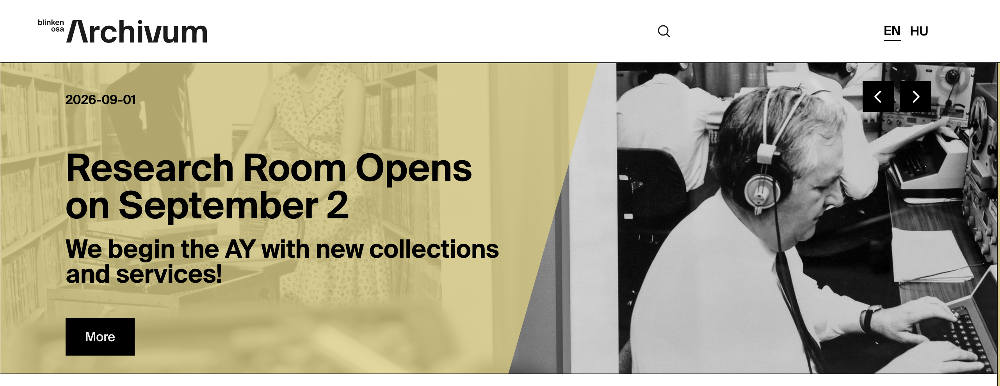

# Home Page Carousel

Each published **Home Page Carousel** record becomes a hero slide at the top of the homepage.

## Where records appear

| Website location | Presentation |
| --- | --- |
| Homepage hero | Up to five responsive slides, ordered by ascending rank |

The slide contains an image background, optional date/time/location, a two-line title, a two-line subtitle, and an optional button. Profile controls its section colour.

## Frontend example

*An Archivum-profile carousel slide. The profile supplies the yellow overlay, while the record supplies the image, text, date, and call-to-action.*

## Field-to-frontend map

| Strapi field | [Scope](index.md#field-scope) | Where on the frontend | Display and editorial effect |
| --- | --- | --- | --- |
| `Date` | Shared | Hero top row | Printed when present. |
| `Image` | Shared, required | Full hero background | Responsive small/medium/full image source. |
| `Location` | Localized | Hero top row | Printed beside/below date information. |
| `Title1stRow` | Localized, required | Hero title | First title line. |
| `Title2ndRow` | Localized | Hero title | Optional second title line. |
| `Subtitle1stRow` | Localized | Hero lower area | First subtitle line. |
| `Subtitle2ndRow` | Localized | Hero lower area | Optional second subtitle line. |
| `Link` | Localized | Not displayed/used | Current hero does not read this field. |
| `ButtonText` | Localized | Hero call-to-action | Creates a button when not empty. |
| `ButtonLink` | Localized | Hero call-to-action | Button destination; without it the visible button has no navigation target. |
| `Time` | Shared | Hero top row | Displayed beside Date, shortened to hours and minutes. |
| `rank` | Shared | Slide ordering | Lower values appear first. Keep ranks unique. |
| [`Profile`](../profiles.md) | Shared | Slide background colour | Selects Archivum, Collections, Academic, or Public styling. |
