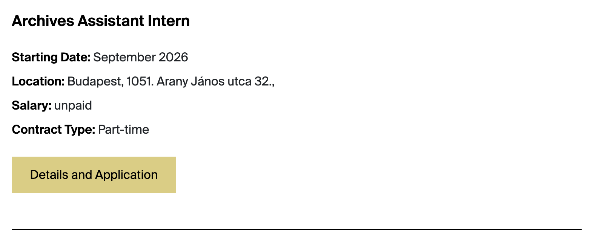

# Job

Use **Job** for vacancies and internships shown on the Jobs and Internships page.

## Where Job records appear

| Website location | Presentation |
| --- | --- |
| About Us → Jobs and Internships | Listing card grouped/filtered by JobType, with title, teaser, practical fields, and details button |
| `/about-us/jobs/{slug}` | Detail page with practical fields and rich-text body |
| Browser/social metadata | Title, teaser, and Image |

### Jobs and Internships listing example

*The listing displays `Title` and the practical fields `StartingDate`, `Location`, `Salary`, and `ContractType` when provided. “Details and Application” opens the Job detail page at its `Slug`; the application information belongs in the detail-page `Content`.*

## Field-to-frontend map

| Strapi field | [Scope](index.md#field-scope) | Where on the frontend | Display and editorial effect |
| --- | --- | --- | --- |
| `Title` | Localized | Listing card, detail heading, metadata | Public vacancy title. |
| `Image` | Shared, required | Social metadata only | Not visibly rendered in the current list/detail layout. |
| `JobType` | Shared, required | Listing query/group | Separates Job and Internship records. |
| `ContentHighglight` | Localized, required | Intended listing teaser/metadata | Currently not displayed because the frontend requests `ContentHighlight` with different spelling. |
| `Content` | Localized, required | Detail body | Rich-text vacancy description. |
| `StartingDate` | Localized | Listing card and detail page | Labelled practical value. |
| `Duration` | Localized | Listing card and detail page | Labelled practical value. |
| `Location` | Localized | Listing card and detail page | Labelled practical value. |
| `ContractType` | Localized, required | Listing card and detail page | Translated Full-Time or Part-Time value. |
| `Salary` | Localized | Listing card and detail page | Labelled practical value. |
| `Slug` | Localized | Detail URL | Final path segment. |
| `ApplicationDeadline` | Localized | Detail page only | Labelled deadline value. |

!!! warning
    `ContentHighglight` is misspelled in the schema. The frontend reads `ContentHighlight`, so editors cannot currently make the teaser appear through the required field.
