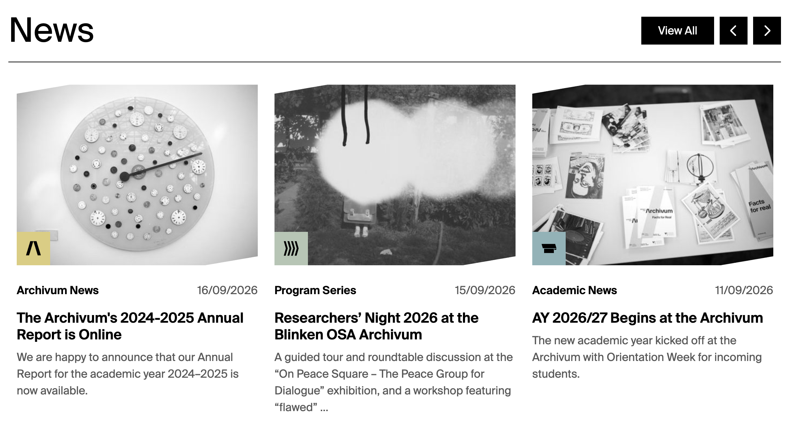

# News

Use **News** for institutional news items.

## Where News records appear

| Website location | Presentation |
| --- | --- |
| Homepage News carousel | Card; newest OriginalCreationDate first |
| News listing | Paginated/filterable card grid |
| `/news/{slug-or-id}` | Detail page with image header, date, author area, component body, and Related Materials |
| Related Materials elsewhere | News card |

### Homepage News carousel example

*Published News records become cards in the homepage carousel. `Image`, `Title`, and `CardText` provide the main content; `OriginalCreationDate` supplies the date; `ActivityType` supplies the label and icon; and `Profile` supplies the coloured square behind the icon.*

### Activity type icons

The News card prints the localized `ActivityType` label above the title and displays its icon over the lower-left corner of the image. The icon itself is black; the background square uses the record's [Profile colour](../profiles.md).

| Strapi `ActivityType` value | Card icon | Icon used |
| --- | :---: | --- |
| `Academic News` | { .activity-type-icon } | Academics category |
| `Announcement` | { .activity-type-icon } | Announcement |
| `Archivum News` | { .activity-type-icon } | Archivum category |
| `Book Launch` | { .activity-type-icon } | Book launch |
| `Collections News` | { .activity-type-icon } | Collections category |
| `Community` | { .activity-type-icon } | Community |
| `Conference` | { .activity-type-icon } | Conference |
| `Education Program` | { .activity-type-icon } | Education program |
| `Exhibition` | { .activity-type-icon } | Exhibition |
| `Film Screening` | { .activity-type-icon } | Film screening |
| `Guided Tour` | { .activity-type-icon } | Talk/speech |
| `Internship` | { .activity-type-icon } | Internship |
| `Job` | { .activity-type-icon } | Job |
| `Join Us` | { .activity-type-icon } | Join us |
| `Lecture` | { .activity-type-icon } | Talk/speech |
| `Library` | { .activity-type-icon } | Library |
| `Music` | { .activity-type-icon } | Music |
| `Partner Projects` | { .activity-type-icon } | Partner projects |
| `Performance` | { .activity-type-icon } | Theatre |
| `Program Series` | { .activity-type-icon } | Program series |
| `Public Program News` | — | **No icon is currently mapped by the frontend.** |
| `Publication` | { .activity-type-icon } | Publication |
| `Research` | { .activity-type-icon } | Research |
| `Roundtable` | { .activity-type-icon } | Roundtable |
| `Scholarship` | { .activity-type-icon } | Scholarship |
| `Talk` | { .activity-type-icon } | Talk/speech |
| `Theatre` | { .activity-type-icon } | Theatre |
| `University Course` | { .activity-type-icon } | University course |
| `Workshop` | { .activity-type-icon } | Workshop |

!!! warning
    Avoid `Public Program News` when an icon is required on the card. The current frontend does not map this value to an icon, and its multi-word label lookup is also inconsistent with the available translation key.

## Field-to-frontend map

| Strapi field | [Scope](index.md#field-scope) | Where on the frontend | Display and editorial effect |
| --- | --- | --- | --- |
| `Title` | Localized, required | Card, detail header, metadata, related card | Public headline. |
| `Image` | Shared, required | Cards, detail header, social preview | Main news artwork. |
| `CardText` | Localized, required | Cards, social description, related card | Teaser summary; truncated on cards. |
| [`Profile`](../profiles.md) | Localized, required | Card/detail colour and list filtering | Selects Archivum, Collections, Academic, or Public presentation. |
| `Tags` | Localized | No visible page element | Stored for classification/search. |
| `Content` | Localized, required | Detail body | Ordered dynamic-zone body. |
| `Slug` | Localized | Detail URL | Preferred path; numeric ID is fallback. |
| `Author` | Localized | Detail author area | Plain-text author. |
| `AuthorStaff` | Relation | Detail author badge | Links one Staff author. |
| [`ActivityType`](#activity-type-icons) | Localized, required | Card label/icon and filters | Selects the translated activity label and mapped icon. `Public Program News` currently has no mapped icon. |
| `OriginalCreationDate` | Localized | Card/detail date and ordering | Preferred publication date; creation date is fallback. |
| `rank` | Shared | Not displayed/used | Current News queries sort by date, not rank. |
| `RelatedCollections`, `RelatedEntries`, `RelatedEvents`, `RelatedPages`, `RelatedProjects` | Relations | Related Materials | Adds corresponding cards. |
| `RelatedNewsSource`, `RelatedNewsDesination` | Self-relations | Related Materials | Adds other News cards, subject to the current misspelled destination-field mismatch. |

!!! warning
    The schema spells `RelatedNewsDesination` without “t”, while the related-material renderer expects `RelatedNewsDestination`. Verify self-related News cards on the public page.
