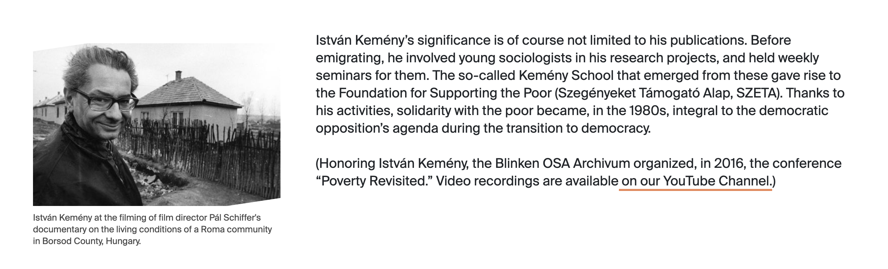
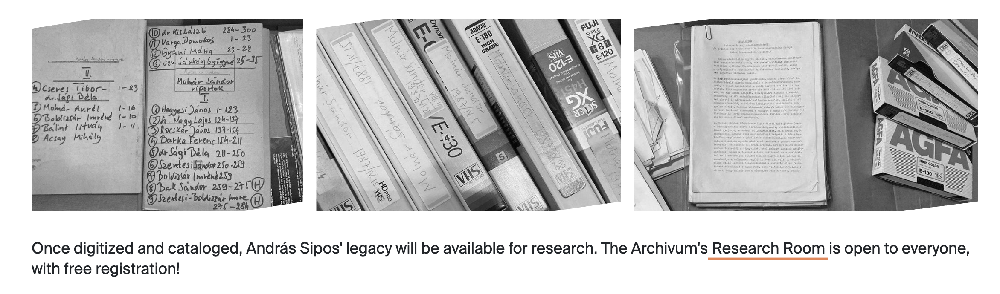
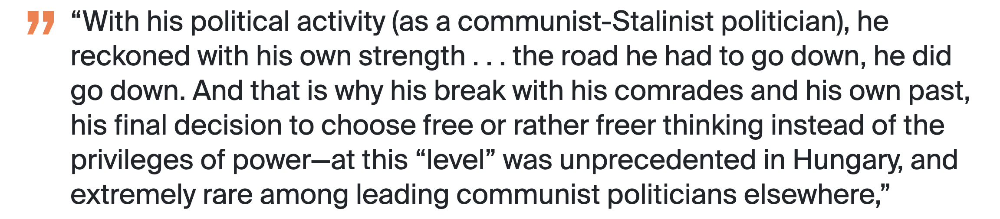
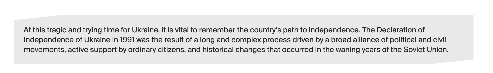
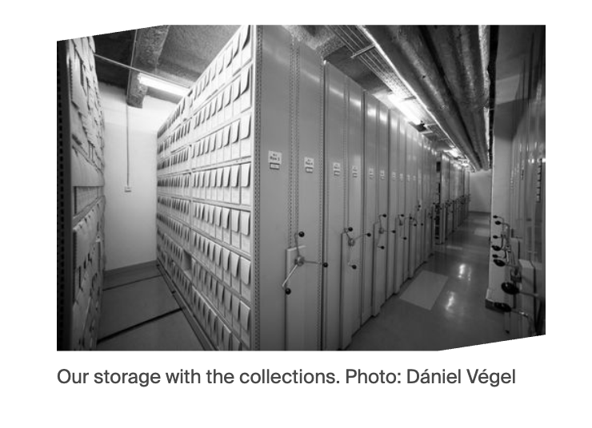
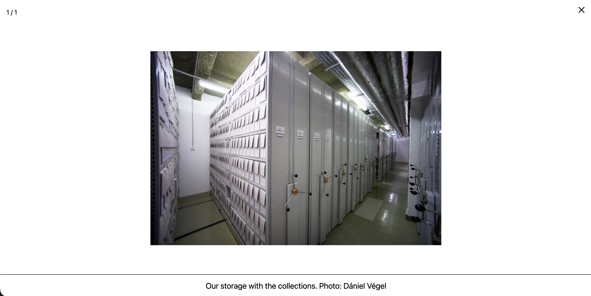
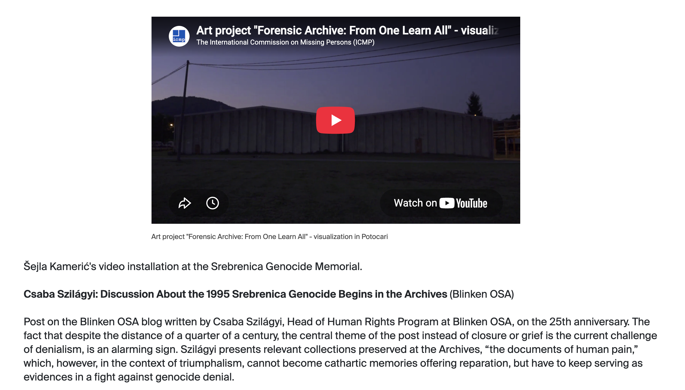
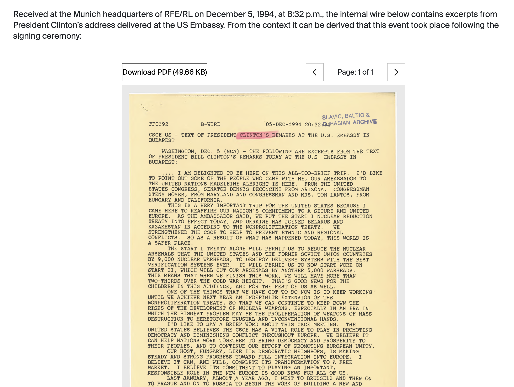
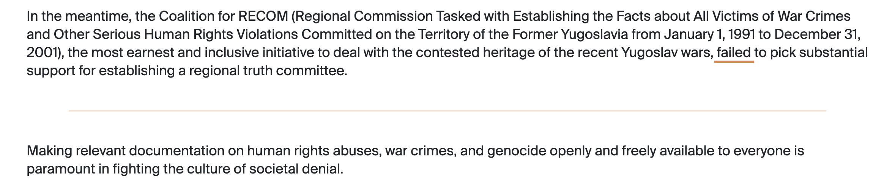
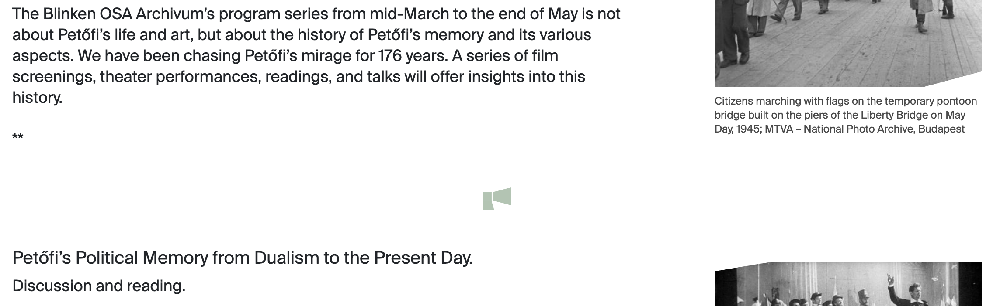

# Content components

The `Content` field is a page builder. Each item becomes one visible section, in the order shown in Strapi. Profile-sensitive components use the colours and icons described in [Profiles and visual identity](profiles.md).

## Components (contents group)

### ContentImage

Combines rich text with zero or more images.

| Field | Result on the website |
| --- | --- |
| `Content` | Required rich-text body. |
| `Images` | Repeatable Image components. Each image can open in a lightbox. |
| `ImagePlacement` | `Left` or `Right` creates a narrow image column beside the text. `Full` places large images above the text. With no value, only the text is shown. |

Use this when an image directly supports a particular passage. On small screens the columns stack.

#### Left alignment example

*`ImagePlacement: Left` with a visible image caption.*

### ContentFull

| Field | Result on the website |
| --- | --- |
| `Content` | Required rich text spanning the full content width. |

Use this for ordinary text sections without side media.

### ImageGallery

| Field | Result on the website |
| --- | --- |
| `Image` | Repeatable Image components arranged in a responsive one-, two-, or three-column gallery. Selecting an image opens a lightbox. |

Keep a gallery visually coherent. Captions are used in the lightbox.

#### ImageGallery example

*An ImageGallery with three images displayed side by side on a wide screen.*

### Quote

| Field | Result on the website |
| --- | --- |
| `Quote` | Plain text displayed as a large, profile-coloured quotation block. |

This is plain text, not the rich-text editor. Include quotation marks only if editorial style requires them.

#### Quote example

*A Quote component displayed with the page profile's accent colour.*

### TextBox

| Field | Result on the website |
| --- | --- |
| `Text` | Required rich text inside a visually distinct box. |
| `Image` | Present in Strapi but **not rendered by the current website**. |

Use this for a callout, short practical information, or a highlighted aside.

#### TextBox example

*A TextBox used to emphasize an introductory passage.*

## Components (media group)

### Image

| Field | Result on the website |
| --- | --- |
| `Image` | Required image, displayed responsively and opened in a lightbox when selected. |
| `Caption` | Optional visible caption; also used to describe the lightbox image. |

In a ContentImage component the size follows `ImagePlacement`. Added directly to the dynamic zone, it spans the content width.

#### Image and lightbox example

{ width="420" style="display: block; margin-inline: auto;" }

*The Image component as it appears within the page.*

*Selecting the image opens the larger colour version in the lightbox. Its caption remains visible below the image.*

### Video

| Field | Result on the website |
| --- | --- |
| `YouTube` | A `youtu.be/...` or `youtube.com/watch?v=...` address is converted to an embedded YouTube player. |
| `Caption` | Required in Strapi and displayed below the YouTube player. |
| `Video` | Upload field exists, but uploaded video files are **not rendered by the current website**. |

!!! warning
    Supply a YouTube URL. A file in `Video` without `YouTube` produces an empty section.

!!! note "Use a clean YouTube URL"
    Enter the video URL without extra parameters, such as a starting time (`&t=90s` or `?start=90`) or an embed URL (`youtube.com/embed/...`). Use `https://youtu.be/VIDEO_ID` or `https://www.youtube.com/watch?v=VIDEO_ID` only. The frontend extracts the video ID from these two URL formats; extra text can prevent the player from loading.

#### Video example

*A Video component showing the YouTube player and its required caption within the page content.*

### PDF

| Field | Result on the website |
| --- | --- |
| `PDF` | Required PDF file. Desktop shows an inline, paginated viewer and download button. Mobile shows a download button. |
| `Caption` | Displayed below the desktop PDF viewer. |

Check the file size and document accessibility before publishing.

#### PDF example

*The desktop PDF viewer provides a download button and controls for moving between document pages.*

## Components (components group)

### DividerIcon and DividerLine

Both components use `Placement`: `Left`, `Right`, or `Full`.

- **DividerIcon** displays the icon associated with the page profile.
- **DividerLine** displays a coloured horizontal rule associated with the page profile.

They separate long sections but should be used sparingly.

#### DividerLine example

*A DividerLine separating two sections. Its colour follows the page's selected profile.*

#### DividerIcon example

*A DividerIcon between two sections. The selected profile determines both the category icon and its colour.*

### IFrame

| Field | Result on the website |
| --- | --- |
| `Source` | Required URL loaded in a borderless, full-width frame with a fixed minimum height. |

Only Page records can add this component. The embedded service must permit framing and should be tested on desktop and mobile. Never paste untrusted URLs.

Currently, the IFrame component is used only to embed Research Room slot registration on the [Research Room booking page](https://archivum.org/collections/research-room-booking).

### DateApprox.

This is not a page-body component. Project uses repeatable `StartDate` and `EndDate` fields made from:

| Field | Meaning |
| --- | --- |
| `Year` | Required four-digit year. |
| `Month` | Optional month, 1–12. |
| `Day` | Optional day, 1–31. |

These dates currently determine whether Academic Projects are current or completed. They are not printed on project cards or detail pages.

## Choosing the right component

| Editorial need | Recommended component |
| --- | --- |
| Normal section of text | ContentFull |
| Text with one or more supporting images | ContentImage |
| Stand-alone large image | Image |
| Several browsable images | ImageGallery |
| Pull quote | Quote |
| Highlighted practical note | TextBox |
| YouTube recording | Video |
| Downloadable document | PDF |
| Embedded booking or external tool | IFrame on a Page |
